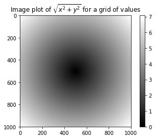

# 3 Numpy


```python
import numpy as np
import matplotlib.pyplot as plt
```


```python
## Numpy ndarray: 多维数组对象
data = np.random.randn(2, 3)
data
```


    array([[ 0.4741133 , -0.70168215, -0.76959806],
           [-0.45809335, -0.47095717, -0.73360045]])


```python
data * 10 
```


    array([[ 4.741133  , -7.01682148, -7.69598062],
           [-4.58093352, -4.70957171, -7.33600455]])


```python
data + data
```


    array([[ 0.9482266 , -1.4033643 , -1.53919612],
           [-0.9161867 , -0.94191434, -1.46720091]])


```python
n, m = data.shape
```


```python
data.dtype
```


    dtype('float64')


```python
# 生成ndarray,应用array()
data1 = [6, 5, 4, 3, 2, 1]
arr1 = np.array(data1)
arr1
```


    array([6, 5, 4, 3, 2, 1])


```python
data2  = [[1, 2, 3, 4],[2, 3, 4, 5]]
```


```python
arr2 = np.array(data2)
arr2
```


    array([[1, 2, 3, 4],
           [2, 3, 4, 5]])


```python
# 检查数组属性
# ndim()
arr2.ndim
```


    2


```python
arr2.shape
```


    (2, 4)


```python
# 创建全为0，或者为1的数组
np.zeros(10)
```


    array([0., 0., 0., 0., 0., 0., 0., 0., 0., 0.])


```python
np.zeros((3, 6))
```


    array([[0., 0., 0., 0., 0., 0.],
           [0., 0., 0., 0., 0., 0.],
           [0., 0., 0., 0., 0., 0.]])


```python
np.ones(10)
```


    array([1., 1., 1., 1., 1., 1., 1., 1., 1., 1.])


```python
np.ones((3, 6))
```


    array([[1., 1., 1., 1., 1., 1.],
           [1., 1., 1., 1., 1., 1.],
           [1., 1., 1., 1., 1., 1.]])


```python
np.empty((2, 3, 2))
```


    array([[[0., 0.],
            [0., 0.],
            [0., 0.]],
    
           [[0., 0.],
            [0., 0.],
            [0., 2.]]])


```python
# array将字符串为数字
numeric_strings = np.array(['1.23', '-9.1', '23'], dtype=np.string_)
```


```python
numeric_strings.astype(float)
```


    array([ 1.23, -9.1 , 23.  ])


```python
# 基础索引和切片
arr = np.arange(10)
```


```python
arr[0]
```


    0


```python
arr1 = arr[5:8].copy()
```


```python
arr1
```


    array([5, 6, 7])


```python
arr2 = arr[5:8]
```


```python
arr2
```


    array([5, 6, 7])


```python
arr2d = np.array([[1, 2, 3], [4, 5, 6], [7, 8, 9]])
```


```python
arr2d[:2]
```


    array([[1, 2, 3],
           [4, 5, 6]])


```python
arr2d[:2, 2]
```


    array([3, 6])


```python
arr2d[:2, 2] = 0
```


```python
arr2d
```


    array([[1, 2, 0],
           [4, 5, 0],
           [7, 8, 9]])


```python
# 布尔索引
names = np.array(['foo', 'bar', 'foo', 'bar', 'foo', 'bob', 'bob'])
data = np.random.rand(7, 4)
```


```python
names
```


    array(['foo', 'bar', 'foo', 'bar', 'foo', 'bob', 'bob'], dtype='<U3')


```python
data
```


    array([[0.21480695, 0.11111881, 0.21386885, 0.29042805],
           [0.91761187, 0.49334349, 0.24090189, 0.13861937],
           [0.42877981, 0.98207196, 0.16941562, 0.8724802 ],
           [0.145148  , 0.04422066, 0.18860211, 0.55134615],
           [0.44584679, 0.96910516, 0.52593669, 0.4585497 ],
           [0.7112824 , 0.22324675, 0.82269094, 0.45706531],
           [0.91968817, 0.85556565, 0.15314799, 0.62379516]])


```python
names == 'bob'
```


    array([False, False, False, False, False,  True,  True])


```python
data[names == 'bob']
```


    array([[0.7112824 , 0.22324675, 0.82269094, 0.45706531],
           [0.91968817, 0.85556565, 0.15314799, 0.62379516]])


```python
data[names != 'bob']
```


    array([[0.21480695, 0.11111881, 0.21386885, 0.29042805],
           [0.91761187, 0.49334349, 0.24090189, 0.13861937],
           [0.42877981, 0.98207196, 0.16941562, 0.8724802 ],
           [0.145148  , 0.04422066, 0.18860211, 0.55134615],
           [0.44584679, 0.96910516, 0.52593669, 0.4585497 ]])


```python
data[~(names == 'bob')]
```


    array([[0.21480695, 0.11111881, 0.21386885, 0.29042805],
           [0.91761187, 0.49334349, 0.24090189, 0.13861937],
           [0.42877981, 0.98207196, 0.16941562, 0.8724802 ],
           [0.145148  , 0.04422066, 0.18860211, 0.55134615],
           [0.44584679, 0.96910516, 0.52593669, 0.4585497 ]])


```python
data[names != 'bob', 2][:1]
```


    array([0.21386885])


```python
mask = (names == 'bar') | (names == 'bob')
```


```python
data[~(mask)]
```


    array([[0.21480695, 0.11111881, 0.21386885, 0.29042805],
           [0.42877981, 0.98207196, 0.16941562, 0.8724802 ],
           [0.44584679, 0.96910516, 0.52593669, 0.4585497 ]])


```python
data[1, 1:] = -data[1, 1:]
```


```python
def change_data(data, i, j):
    data[i, j:] = -data[i, j:]
    return data[i, j:]
data1 = change_data(data, 1, 2)
data1
```


    array([0.24090189, 0.13861937])


```python
data[4, :2] = -data[4, :2]
```


```python
data
```


    array([[ 0.21480695,  0.11111881,  0.21386885,  0.29042805],
           [ 0.91761187, -0.49334349,  0.24090189,  0.13861937],
           [ 0.42877981,  0.98207196,  0.16941562,  0.8724802 ],
           [ 0.145148  ,  0.04422066,  0.18860211,  0.55134615],
           [-0.44584679, -0.96910516,  0.52593669,  0.4585497 ],
           [ 0.7112824 ,  0.22324675,  0.82269094,  0.45706531],
           [ 0.91968817,  0.85556565,  0.15314799,  0.62379516]])


```python
arr = np.empty((8, 4))
```


```python
for i in range(8):
    arr[i] = i
arr
```


    array([[0., 0., 0., 0.],
           [1., 1., 1., 1.],
           [2., 2., 2., 2.],
           [3., 3., 3., 3.],
           [4., 4., 4., 4.],
           [5., 5., 5., 5.],
           [6., 6., 6., 6.],
           [7., 7., 7., 7.]])


```python
arr[[4, 3, 0, 6]]
```


    array([[4., 4., 4., 4.],
           [3., 3., 3., 3.],
           [0., 0., 0., 0.],
           [6., 6., 6., 6.]])


```python
arr[[-1, 0]]
```


    array([[7., 7., 7., 7.],
           [0., 0., 0., 0.]])


```python
arr = np.arange(32).reshape(8, 4)
arr
```


    array([[ 0,  1,  2,  3],
           [ 4,  5,  6,  7],
           [ 8,  9, 10, 11],
           [12, 13, 14, 15],
           [16, 17, 18, 19],
           [20, 21, 22, 23],
           [24, 25, 26, 27],
           [28, 29, 30, 31]])


```python
# 转置
arr.T
```


    array([[ 0,  4,  8, 12, 16, 20, 24, 28],
           [ 1,  5,  9, 13, 17, 21, 25, 29],
           [ 2,  6, 10, 14, 18, 22, 26, 30],
           [ 3,  7, 11, 15, 19, 23, 27, 31]])


```python
# 内积
np.dot(arr.T, arr)
```


    array([[2240, 2352, 2464, 2576],
           [2352, 2472, 2592, 2712],
           [2464, 2592, 2720, 2848],
           [2576, 2712, 2848, 2984]])


```python
arr = np.arange(16).reshape((2, 2, 4))
```


```python
arr
```


    array([[[ 0,  1,  2,  3],
            [ 4,  5,  6,  7]],
    
           [[ 8,  9, 10, 11],
            [12, 13, 14, 15]]])


```python
arr.transpose((1, 0, 2))
```


    array([[[ 0,  1,  2,  3],
            [ 8,  9, 10, 11]],
    
           [[ 4,  5,  6,  7],
            [12, 13, 14, 15]]])


```python
arr.swapaxes(1, 2)
```


    array([[[ 0,  4],
            [ 1,  5],
            [ 2,  6],
            [ 3,  7]],
    
           [[ 8, 12],
            [ 9, 13],
            [10, 14],
            [11, 15]]])


```python
# 通用函数
arr = np.arange(10)
np.sqrt(arr)
```


    array([0.        , 1.        , 1.41421356, 1.73205081, 2.        ,
           2.23606798, 2.44948974, 2.64575131, 2.82842712, 3.        ])


```python
np.exp(arr)
```


    array([1.00000000e+00, 2.71828183e+00, 7.38905610e+00, 2.00855369e+01,
           5.45981500e+01, 1.48413159e+02, 4.03428793e+02, 1.09663316e+03,
           2.98095799e+03, 8.10308393e+03])


```python
x = np.random.randn(8)
y = np.random.randn(8)
```


```python
x
```


    array([ 0.81715249, -1.54400419, -1.36555281,  0.22991868,  1.4551835 ,
            0.48048681,  0.63291472, -0.1751916 ])


```python
y
```


    array([-2.09742295, -1.06434911,  0.74671971,  0.96368351, -0.672754  ,
            1.30242601, -1.69671722,  1.40794722])


```python
# 比较最大值
np.maximum(x, y)
```


    array([ 0.81715249, -1.06434911,  0.74671971,  0.96368351,  1.4551835 ,
            1.30242601,  0.63291472,  1.40794722])


```python
# 浮点数的整数和小数部分
arr =  np.random.randn(7) * 5
s_part, z_part = np.modf(arr)
```


```python
z_part
```


    array([-4.,  2.,  6., -2., 10., -4.,  2.])


```python
s_part
```


    array([-0.5504734 ,  0.61414171,  0.9853902 , -0.1862777 ,  0.98958584,
           -0.17138786,  0.26157901])


```python
# .......通用函数，在书本的p108
```


```python
# 使用数组进行面向数组编程
points = np.arange(-5, 5, 0.01)
xs, ys = np.meshgrid(points,points)
```


```python
xs
```


    array([[-5.  , -4.99, -4.98, ...,  4.97,  4.98,  4.99],
           [-5.  , -4.99, -4.98, ...,  4.97,  4.98,  4.99],
           [-5.  , -4.99, -4.98, ...,  4.97,  4.98,  4.99],
           ...,
           [-5.  , -4.99, -4.98, ...,  4.97,  4.98,  4.99],
           [-5.  , -4.99, -4.98, ...,  4.97,  4.98,  4.99],
           [-5.  , -4.99, -4.98, ...,  4.97,  4.98,  4.99]])


```python
z = np.sqrt(xs ** 2 + ys ** 2)
```


```python
z
```


    array([[7.07106781, 7.06400028, 7.05693985, ..., 7.04988652, 7.05693985,
            7.06400028],
           [7.06400028, 7.05692568, 7.04985815, ..., 7.04279774, 7.04985815,
            7.05692568],
           [7.05693985, 7.04985815, 7.04278354, ..., 7.03571603, 7.04278354,
            7.04985815],
           ...,
           [7.04988652, 7.04279774, 7.03571603, ..., 7.0286414 , 7.03571603,
            7.04279774],
           [7.05693985, 7.04985815, 7.04278354, ..., 7.03571603, 7.04278354,
            7.04985815],
           [7.06400028, 7.05692568, 7.04985815, ..., 7.04279774, 7.04985815,
            7.05692568]])


```python
import matplotlib.pyplot as plt
plt.imshow(z, cmap = plt.cm.gray);
plt.title("Image plot of $\sqrt{x^2 + y^2}$ for a grid of values")
plt.colorbar()
```


    <matplotlib.colorbar.Colorbar at 0x11e777f28>





```python
# 将条件逻辑作为数组操作
xarr = np.arange(5)
```


```python
xarr
```


    array([0, 1, 2, 3, 4])


```python
yarr = xarr + 1
```


```python
yarr
```


    array([1, 2, 3, 4, 5])


```python
cond = np.array([True, False, True, True, False])
```


```python
result = [(x if c else y) for x, c, y in zip(xarr, cond, yarr)]
```


```python
result
```


    [0, 2, 2, 3, 5]


```python
result = np.where(cond, xarr, yarr)
```


```python
result
```


    array([0, 2, 2, 3, 5])


```python
arr = np.random.randn(4, 4)
```


```python
arr
```


    array([[ 1.22831605, -1.41111539,  0.73637456,  0.46925739],
           [-0.03511393,  1.2698253 ,  0.26891989, -0.65442546],
           [-0.8214838 , -2.17071515,  0.08049618, -1.29502338],
           [-0.94432642, -1.23247632, -0.96468754,  1.13716478]])


```python
arr > 0
```


    array([[ True, False,  True,  True],
           [False,  True,  True, False],
           [False, False,  True, False],
           [False, False, False,  True]])


```python
# 正值用2代替，负值用-2代替
np.where(arr > 0, 2, -2)
```


    array([[ 2, -2,  2,  2],
           [-2,  2,  2, -2],
           [-2, -2,  2, -2],
           [-2, -2, -2,  2]])


```python
np.where(arr > 0, 2, arr)
```


    array([[ 2.        , -1.41111539,  2.        ,  2.        ],
           [-0.03511393,  2.        ,  2.        , -0.65442546],
           [-0.8214838 , -2.17071515,  2.        , -1.29502338],
           [-0.94432642, -1.23247632, -0.96468754,  2.        ]])


```python
arr.mean()
```


    -0.27118832752963207


```python
np.mean(arr)
```


    -0.27118832752963207


```python
np.sum(arr)
```


    -4.339013240474113


```python
# 计算每一列的平均值
arr.mean(axis=1)
# 计算每一行
arr.mean(axis=0)
```


    array([-0.14315203, -0.88612039,  0.03027577, -0.08575667])


```python
arr = np.arange(8)
```


```python
arr
```


    array([0, 1, 2, 3, 4, 5, 6, 7])


```python
# 累加
arr.cumsum()
```


    array([ 0,  1,  3,  6, 10, 15, 21, 28])


```python
# 累积
arr[1:].cumprod()
```


    array([   1,    2,    6,   24,  120,  720, 5040])


```python
arr = np.arange(9).reshape(3,3)
arr
```


    array([[0, 1, 2],
           [3, 4, 5],
           [6, 7, 8]])


```python
arr.cumsum(axis=1)
```


    array([[ 0,  1,  3],
           [ 3,  7, 12],
           [ 6, 13, 21]])


```python
arr.cumprod(axis=1)
```


    array([[  0,   0,   0],
           [  3,  12,  60],
           [  6,  42, 336]])


```python
# 布尔值数组的方法
arr = np.random.randn(100)
```


```python
(arr > 0).sum()
```


    49


```python
cond = np.array([True, False, True, True, False])
```


```python
cond.any()
```


    True


```python
cond.all()
```


    False


```python
arr = np.random.randn(10)
arr
```


    array([ 4.77492679e-01,  9.91953783e-01,  1.56567170e+00, -2.02378785e+00,
           -5.37533289e-01, -1.27099964e-01, -3.96818079e-01, -1.58855081e+00,
            2.64831975e-04,  1.38917806e+00])


```python
arr.sort()
arr
```


    array([-2.02378785e+00, -1.58855081e+00, -5.37533289e-01, -3.96818079e-01,
           -1.27099964e-01,  2.64831975e-04,  4.77492679e-01,  9.91953783e-01,
            1.38917806e+00,  1.56567170e+00])


```python
arr = np.random.randn(5, 4)
arr
```


    array([[-1.70570863,  0.08173526,  0.46599926, -0.35850013],
           [ 0.67988946, -0.03656272,  0.06166579,  1.89141665],
           [-1.0392125 , -0.55569358, -1.19174342,  0.68597294],
           [-1.32279161, -1.09124897, -0.48714476,  0.46924978],
           [-0.98947839, -0.63062552,  1.51066119,  1.90259703]])


```python
arr.sort(1)
arr
```


    array([[-1.70570863, -0.35850013,  0.08173526,  0.46599926],
           [-0.03656272,  0.06166579,  0.67988946,  1.89141665],
           [-1.19174342, -1.0392125 , -0.55569358,  0.68597294],
           [-1.32279161, -1.09124897, -0.48714476,  0.46924978],
           [-0.98947839, -0.63062552,  1.51066119,  1.90259703]])


```python
arr.sort(0)
arr
```


    array([[-1.70570863, -1.09124897, -0.55569358,  0.46599926],
           [-1.32279161, -1.0392125 , -0.48714476,  0.46924978],
           [-1.19174342, -0.63062552,  0.08173526,  0.68597294],
           [-0.98947839, -0.35850013,  0.67988946,  1.89141665],
           [-0.03656272,  0.06166579,  1.51066119,  1.90259703]])


```python
cond = np.array([True, False, True, True, False])
```


```python
np.unique(cond)
```


    array([False,  True])


```python
arr = np.arange(5)
```


```python
# 检查一个数组的值是否在另一个数组中出现
np.in1d(arr, [3, 4])
```


    array([False, False, False,  True,  True])


```python
cond[np.in1d(arr,[3, 4])]
```


    array([ True, False])


```python
# 线性代数
x = np.arange(7)[1:].reshape(2,3)
```


```python
y = np.array([[6, 23], [-1, 7], [8, 9]])
```


```python
x
```


    array([[1, 2, 3],
           [4, 5, 6]])


```python
y
```


    array([[ 6, 23],
           [-1,  7],
           [ 8,  9]])


```python
x.dot(y)
```


    array([[ 28,  64],
           [ 67, 181]])


```python
np.dot(x, np.ones(3))
```


    array([ 6., 15.])


```python
x @ np.ones(3)
```


    array([ 6., 15.])


```python
from numpy.linalg import inv, qr 
```


```python
x = np.random.randn(5, 5)
```


```python
mat = x.T.dot(x)
```


```python
inv(mat)
```


    array([[ 1.94822589, -1.03946529,  0.73877948, -1.84029211,  1.93635299],
           [-1.03946529,  1.72270986, -1.30555066,  1.95688734, -0.34129512],
           [ 0.73877948, -1.30555066,  1.25211393, -1.82714557, -0.05851413],
           [-1.84029211,  1.95688734, -1.82714557,  3.82768591, -0.66460287],
           [ 1.93635299, -0.34129512, -0.05851413, -0.66460287,  3.17287065]])


```python
mat.dot(inv(mat))
```


    array([[ 1.00000000e+00,  2.00953643e-16,  2.00564973e-17,
             1.07699813e-16,  6.53473266e-16],
           [-2.57156455e-17,  1.00000000e+00,  4.18413565e-16,
             5.92042266e-16,  2.41520660e-17],
           [ 9.46199738e-16,  6.43159285e-17,  1.00000000e+00,
             1.56082560e-16,  2.91056870e-16],
           [-2.48241765e-16,  8.39819063e-16, -1.56231743e-16,
             1.00000000e+00, -6.25447288e-16],
           [ 4.85404289e-17,  8.11792607e-17, -4.64201865e-17,
            -1.10913778e-16,  1.00000000e+00]])


```python
q, r = qr(mat)
```


```python
r
```


    array([[-6.06791029, -0.56551913,  0.3789997 , -1.92644922,  3.38886462],
           [ 0.        , -4.87371913, -7.72430277, -1.37452182, -0.98147195],
           [ 0.        ,  0.        , -2.462379  , -1.38698957, -0.36175297],
           [ 0.        ,  0.        ,  0.        , -0.22200533, -0.13552085],
           [ 0.        ,  0.        ,  0.        ,  0.        ,  0.26372307]])


```python
# 伪随机数，为什么要用seed函数？？？
samples = np.random.normal(size=(4,4))
samples
```


    array([[-1.35202093,  0.78541372, -0.49849382,  0.18745685],
           [ 0.02915794, -1.14879586, -1.18553402, -0.30747614],
           [-1.05828271, -0.53718131,  0.05706482,  0.68363159],
           [ 0.02951789, -0.46497861,  0.46920011,  0.54977282]])


```python
from random import normalvariate
n = 1000000
%timeit samples = [normalvariate(0, 1) for _ in range(n)]
```

    638 ms ± 16.7 ms per loop (mean ± std. dev. of 7 runs, 1 loop each)


```python
%timeit samples = np.random.normal(size = n)
```

    26.9 ms ± 1.34 ms per loop (mean ± std. dev. of 7 runs, 10 loops each)


```python
np.random.seed(1234)
```


```python
rng = np.random.RandomState(1234)
a = rng.randn(10)
print(a)
plt.plot(a)
```

    [ 0.47143516 -1.19097569  1.43270697 -0.3126519  -0.72058873  0.88716294
      0.85958841 -0.6365235   0.01569637 -2.24268495]


    [<matplotlib.lines.Line2D at 0x1211322b0>]


```python
rng.randn(10)
```


    array([ 1.15003572,  0.99194602,  0.95332413, -2.02125482, -0.33407737,
            0.00211836,  0.40545341,  0.28909194,  1.32115819, -1.54690555])


```python
# 示例：随机漫步
import random
pos = 0
walk = [pos]
steps = 1000
for i in range(steps):
    step = 1 if random.randint(0,1) else -1
    pos += step
    walk.append(pos)
```


```python
plt.plot(walk[:100])
```


    [<matplotlib.lines.Line2D at 0x12060b668>]


```python
nsteps = 1000
draws = np.random.randint(0, 2, size=nsteps)
steps = np.where(draws > 0, 1, -1)
walk = steps.cumsum()
plt.plot(walk[:100])
```


    [<matplotlib.lines.Line2D at 0x1210f6518>]


```python
(np.abs(walk) >= 10).argmax()
```


    297


```python
nwalks = 5000
nsteps = 1000
# draws = np.random.randint(0, 2, size=(nwalks, nsteps))
# 正态分布
draws = np.random.normal(loc=0, scale=0.25, size=(nwalks,nsteps))
steps = np.where(draws > 0, 1, -1)
walk = steps.cumsum(1)
```


```python
walk
```


    array([[  1,   2,   1, ..., -22, -23, -22],
           [ -1,  -2,  -3, ...,  32,  33,  34],
           [ -1,  -2,  -3, ...,  42,  41,  42],
           ...,
           [ -1,  -2,  -3, ...,  16,  15,  14],
           [ -1,  -2,  -3, ...,   0,  -1,   0],
           [  1,   0,   1, ..., -12, -11, -10]])


```python
walk.max()
```


    131


```python
walk.min()
```


    -112


```python
hist30 = (np.abs(walk) >= 30).any(1)
hist30.sum()
```


    3376


```python
crossing_times = (np.abs(walk[hist30]) >= 30).argmax(1)
```


```python
crossing_times.mean()
```


    501.18364928909955


```python

```
